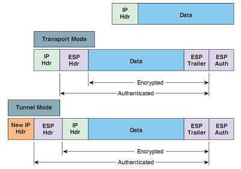

---

## Introduction

Internet Protocol Security (IPsec) is a secure network protocol suite that authenticates and encrypts the packets of data to provide secure encrypted communication between two computers over an Internet Protocol network. It is used in virtual private networks (VPNs).

**Internet Key Exchange (IKE)** is a protocol used to set up a **security association (SA)**. IKE is responsible for securely exchanging encryption keys using Diffie–Hellman key exchange, to authenticate IPSec peers using pre-shared or Public Keys and negotiating IPSec SA. IKE consists of two phases, Phase 1 and Phase 2 described below:

1. Phase: In this phase potential IPSec peers are authenticated and an IKE/ISAKMP SA is established using Diffie–Hellman key exchange. A secure channel is established between potential IPSec peers using encryption, authentication and hash algorithms. The purpose of this phase is to provide a secure channel between peers for secure Phase 2 negotiation

1. Phase: In this phase the potential IPSec peers will use the secure channel established in Phase 1 to negotiate and establish IPSec SAs using ESP or AH protocols to protect the actual data traffic.  IKE provides secure exchange of cryptographic keys between two IPSec endpoints, VPN gateways for example. IKE defines the methods in how endpoints using IPSec authenticate to each other.

IKE operates in phase 1 and phase 2. In phase 1 mutual authentication is performed using pre-shared keys, in which the encryption and integrity session keys are generated. The key exchange can be processed via main mode or aggressive mode. In phase 2 a security association (SA) is established using the quick mode key exchange process, which negotiates methods used to encrypt information from both IPSec endpoints.

* **Security association (SA)** is a relationship between two or more entities that describes how the entities will use security services to communicate securely.

* **Encapsulating Security Payload (ESP)** is used to provide confidentiality, data integrity, authentication and anti-replay services. ESP encrypts (using a variety of encryption algorithms such as DES, 3DES and AES) the original payload and encapsulates the packet between an ESP header and trailer. ESP uses IP Protocol number of 50

* **Authentication Header (AH)** is used to provide connectionless integrity, data authentication and optional relay protection. Unlike ESP, AH does not provide confidentiality. AH uses IP Protocol number of 51

2 Phase Connection Modes: There are two types of modes that AH and ESP can use to transport data between two entities

1. **Transport Mode:** In this mode, AH or ESP header is inserted between the IP header and upper layer protocol header. The IP header is the same as the original header except for the Protocol Field which is either 50 (ESP) or 51 (AH). When using Transport mode the two entities over which the VPN is established must be reachable, the IPSec and IP endpoint are same when using transport mode, and therefore it used to protect host-host communications.

1. **Tunnel Mode:** In this mode, the original IP packet is encapsulated in another IP datagram and the AH or ESP header is inserted between outer and inner headers. Because of this encapsulation IPSec and IP endpoints can be different and a gateway router at each site can provide secure service on behalf of hosts at each site. Site-to-Site VPN uses tunnel mode to secure communications between hosts at different sites.

## Oakley Key Determination Protocol

Oakley is used along side ISAKMP, and is now commonly known as IKE (Internet Key Exchange). Basically Oakley is a protocol to carry out the key exchange negotiation process for both peers, in which both ends after being authenticated can agree on secure and secret keying material. Oakley is based on the Diffie-Hellman key algorithm in which two gateways can agree on a key without the need to encrypt. The goal of this protocol is to provide that mechanism, coupled with a great deal of cryptographic strength.The Diffie-Hellman key exchange algorithm provides such a mechanism. It allows two parties to agree on a shared value without requiring encryption.  The shared value is immediately available for use in encrypting subsequent conversation, e.g. data transmission and/or authentication.

## ISAKMP (Internet Security Association and Key Management Protocol)

ISAKMP is a key exchange architecture or framework used within IPSec, which manages the exchange of keys between both endpoints.
Some of the key requirements achieved using ISAKMP;

* Management of keys
* Authentication - To authenticate peer gateway devices
* Manage Security Associations
* Protection against Denial of service and replay attacks

***ISAKMP is also commonly known as IKE (Internet key exchange) or ISAKMP/Oakley.***

## Implementation of Diffie Hellman Algorithm

](flowcharts/df_enc.png)

### Diffie-Hellman Groups

Diffie-Hellman (DH) groups determine the strength of the key used in the key exchange process. Higher group numbers are more secure, but require additional time to compute the key.

Fireware supports these Diffie-Hellman groups:

* DH Group 1: 768-bit group
* DH Group 2: 1024-bit group
* DH Group 5: 1536-bit group
* DH Group 14: 2048-bit group
* DH Group 15: 3072-bit group
* DH Group 19: 256-bit elliptic curve group
* DH Group 20: 384-bit elliptic curve group

Both peers in a VPN exchange must use the same DH group, which is negotiated during Phase 1 of the IPSec negotiation process. When you define a manual BOVPN tunnel, you specify the Diffie-Hellman group as part of Phase creation of an IPSec connection. This is where the two peers make a secure, authenticated channel they can use to communicate.
DH groups and Perfect Forward Secrecy (PFS)
In addition to Phase 1, you can also specify the Diffie-Hellman group to use in Phase 2 of an IPSec connection. Phase 2 configuration includes settings for a security association (SA), or how data packets are secured when they are passed between two endpoints. You specify the Diffie-Hellman group in Phase 2 only when you select Perfect Forward Secrecy (PFS).
PFS makes keys more secure because new keys are not made from previous keys. If a key is compromised, new session keys are still secure. When you specify PFS during Phase 2, a Diffie-Hellman exchange occurs each time a new SA is negotiated.
The DH group you choose for Phase 2 does not need to match the group you choose for Phase 1.

 In our implementation we provides two ways of authenticating user over a network.

 1. Psk Authentication
 2. Pubkey Authentication

## Psk Authentication

Pre-shared Key (Psk) is a mode of authenticating a user on the basis of pre-shared key. These pre-shared keys are generated using key deviation functions.These keys come as part of config-maps decided by the operator before initiating the deployment over Kubernetes cluster.

## Pubkey Authentication

Public Key (Pubkey) Authentication is a more secured way of authenticating a user over a network.

---

